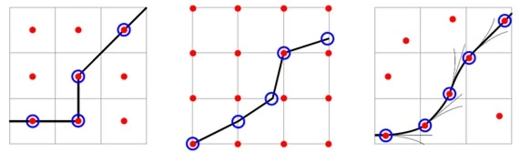
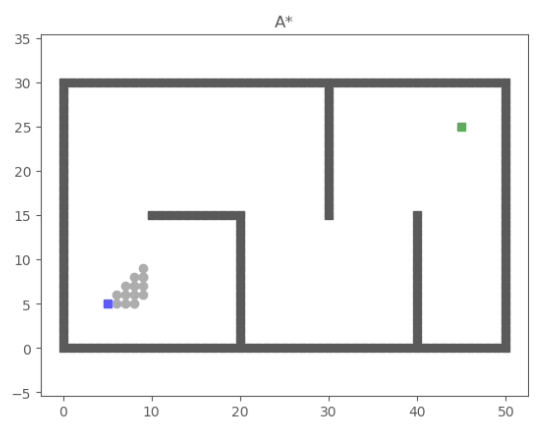
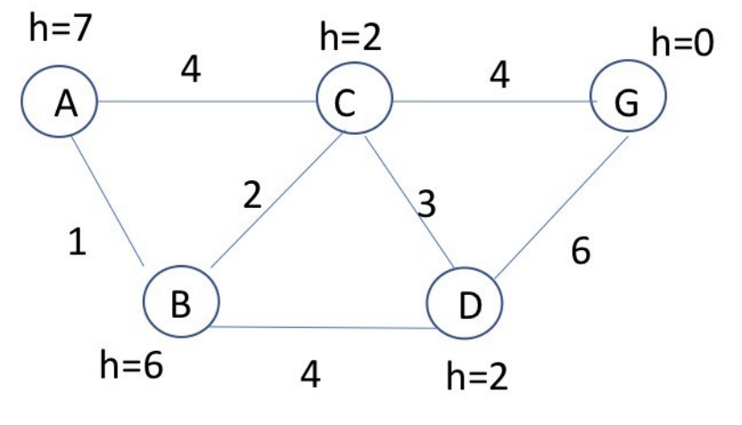
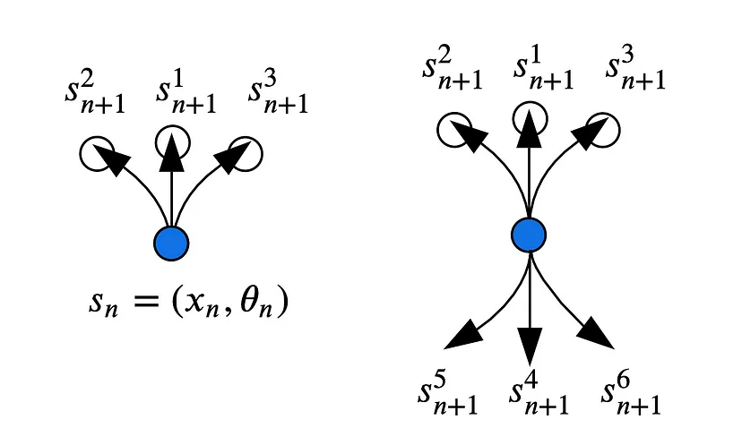
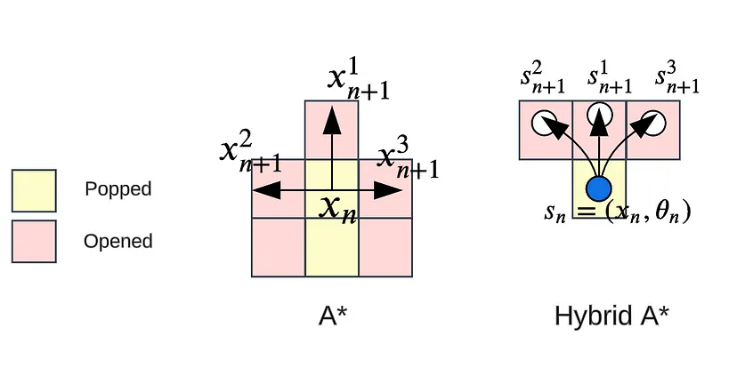

# Hybrid A* algorithm and differences from standard
An [algorithm](https://www.geeksforgeeks.org/fundamentals-of-algorithms/) is a finite sequence of well-defined instructions that can be used to solve a computational problem. It provides a step-by-step procedure that convert an input into a desired output.

## A* algorithm
The **A* algorithm** is a pathfinding algorithm  uses both benefits of **Dijkstra’s Algorithm** and **Greedy Best First Search**. 
 * **Dijkstra’s Algorithm** works well to find the shortest path, but wastes time exploring unpromising directions.
 * **Greedy Best First Search** explores in promising directions but it may not find the shortest path. 

A* improves by considering both the actual distance from the start and the estimated distance to the goal.

Each time through the main loop, it examines the vertex n that has the lowest f(n) = g(n) + h(n).
 * g(n) represents the exact cost of the path from the starting point to any vertex n.
 * h(n) represents the heuristic estimated cost from vertex n to the goal. 

A* balances the two as it moves from the starting point to the goal.

 

 

 * A (-, 7): Expand A → Results in B(A, 1), C(A, 4).
 * C(A, 4, 2), B(A, 1, 6): Expand C → Results in B(AC, 6), D(AC, 7), G(AC, 8).
 * B(A, 1, 6), G(AC, 8, 0), D(AC, 7, 2), B(AC, 6, 6): Expand B → Results in C(AB, 3), D(AB, 5).
 * C(AB, 3, 2), D(AB, 5, 2), G(AC, 8, 0), D(AC, 7, 2), B(AC, 6, 6): Expand C → Results in D(ABC, 6), G(ABC, 7).
 * D(AB, 5, 2), G(ABC, 7, 0), G(AC, 8, 0), D(ABC, 6, 2), D(AC, 7, 2), B(AC, 6, 6): Expand D → Results in C(ABD, 8), G(ABD, 11).
 * G(ABC, 7, 0), G(AC, 8, 0), D(ABC, 6, 2), D(AC, 7, 2), C(ABD, 8, 2), G(ABD, 11, 0), B(AC, 6, 6): Goal node G is found through ABC.

[Animation sources](https://www.redblobgames.com/pathfinding/a-star/introduction.html)

## Hybrid A* Algorithm
extends the `standard A* algorithm` for more complex motion planning, considered one of the most popular path planning algorithms for car-like robots.

check out[Artificial Intelligence for Robotics](https://youtu.be/qXZt-B7iUyw?si=btkN0XP_qiF3LEEY)

**Hybrid A*:**
 * **Objective**: Hybrid A* extends A* to car-like robots by finding a sequence of safe poses (position + orientation) from start to goal in a continuous state space SE(2). The car's non-holonomic constraints, such as limited turning radius, are considered in the search process.
 * **Kinematic Model**: The car's motion is modeled using Dubins paths for forward-only movements or Reeds-Shepp paths for forward and reverse motions, enabling more realistic vehicle behavior.
car-like moving as below:
 

**difference A* and Hybrid A*:**
 

**Search Process:**
 * Instead of expanding along grid cells, Hybrid A* simulates the vehicle's kinematic behavior, opening new states based on the car's motion constraints.
 * Cost Calculation: The path cost between states accounts for movement arc length, with penalties for undesirable actions like sharp turns or reversing.

**heuristic function ℎ(𝑠)**
 * h(s), a crucial element in Hybrid A* for selecting the best state for propagation. Standard A*, the heuristic guides the search in a 2D positional grid, but in the SE(2) space, the heuristic needs to estimate the shortest path considering the robot’s pose (position and orientation).

**Nonholonomic Heuristic**
 * Use [Dubins paths](https://en.wikipedia.org/wiki/Dubins_path) (for forward motion) or Reeds-Shepp paths (for forward and reverse motion)

**Holonomic Heuristic with Obstacles**
 * Use a grid-based method similar to Dijkstra’s algorithm to calculate the shortest path around obstacles and combined with the nonholonomic heuristic.

**Analytical Expansion**
 * connect the best candidate state directly to the goal using a collision-free path

**Implementation**
 * Hybrid A Star automatically searches for a target point from the farthest free region.
 * It takes 100~400ms.
 [Hybrid A Star Path Planner for Autonomous Vehicle Obstacle Avoidance](https://youtu.be/blGubY4PztI?si=RS_WBgj9CCLlMPWI)